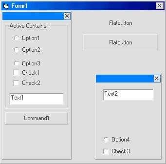



## activebar

### Description

creates containers for objects
 
### More Info
 
use restore function to bring back up the bar if you close it

             |
---                |---
**Submitted On**   |2000-07-31 18:36:34
**By**             |[brad barnich](https://github.com/Planet-Source-Code/PSCIndex/blob/master/ByAuthor/brad-barnich.md)
**Level**          |Beginner
**User Rating**    |3.8 (23 globes from 6 users)
**Compatibility**  |VB 6\.0
**Category**       |[Custom Controls/ Forms/  Menus](https://github.com/Planet-Source-Code/PSCIndex/blob/master/ByCategory/custom-controls-forms-menus__1-4.md)
**World**          |[Visual Basic](https://github.com/Planet-Source-Code/PSCIndex/blob/master/ByWorld/visual-basic.md)
**Archive File**   |[CODE\_UPLOAD84537312000\.zip](https://github.com/Planet-Source-Code/brad-barnich-activebar__1-10266/archive/master.zip)

